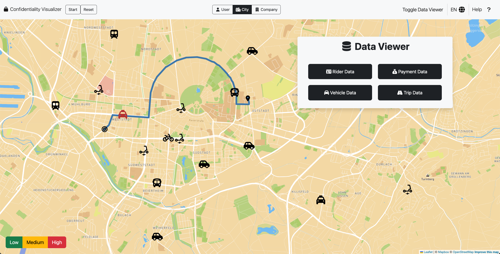

# TES-SS22-VisualizingConfidentialityInMobilitySystems

Willkommen zu unserem web-basierten Demonstrator zur Visualisierung vertraulicher Daten in Mobilitätssystemen.

## Dokumentation

Genauere Beschreibungen und Anleitungen zu unserem Projekt befinden sich im [Wiki](https://github.com/KASTEL-MobilityLab/TES-SS22-VisualizingConfidentialityInMobilitySystems/wiki)
